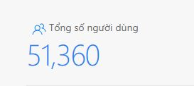
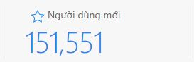
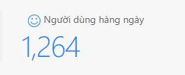
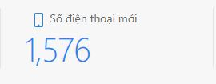
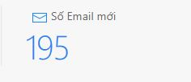
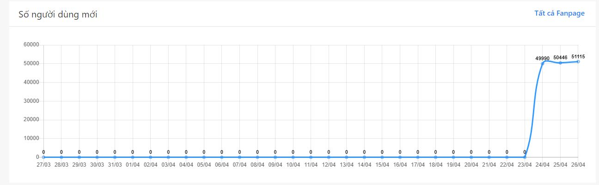
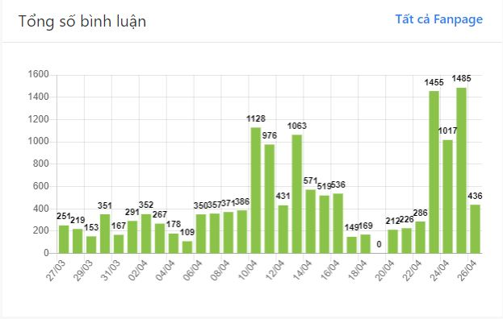

### I. Thống kê tổng quan
#### 1. Tổng số người dùng
- Tổng số người dùng trong thời gian thống kê
- Mặc định ban đầu là tổng số người dùng của tất cả các fanpage trong project 
   

#### 2. Người dùng mới
- Người dùng mới là người mới nhắn tin, bình luận tới fanpage
- Tổng số người dùng mới trong thời gian thống kê
- Mặc định ban đầu là tổng số người dùng mới của tất cả các fanpage trong project 
   
   

#### 3. Người dùng hằng ngày
- Là trung bình số người dùng tương tác với fanpage
- Tính bằng **Tổng số người dùng tương tác với fanpage** / **Tổng số ngày trong thời gian thống kê**
- Mặc định ban đầu là tổng số người dùng hằng ngày của tất cả các fanpage trong project 
   

#### 4. Số điện thoại mới
- Tổng số điện thoại được người dùng cung cấp trong thời gian thống kê
- Mặc định ban đầu là tổng số điện thoại của tất cả các fanpage trong project 
   
     

#### 5. Số email mới
- Tổng số email mà người dùng cung cấp trong thời gian thống kê
- Mặc định ban đầu là tổng số email của tất cả các fanpage trong project 
   

#### 6. Biểu đồ số người dùng mới
- Liệt kê số người dùng mới theo ngày trong thời gian thống kê
- Mặc định ban đầu là tổng số người dùng mới của tất cả các fanpage trong project 
   

#### 7. Tổng số tin nhắn
- Liệt kê số tin nhắn mỗi ngày trong thời gian thống kê
- Mặc định ban đầu là tổng số tin nhắn của tất cả các fanpage trong project 
   

#### 8. Tổng số bình luận
- Liệt kê số bình luận mỗi ngày trong thời gian thống kê
- Mặc định ban đầu là tổng số bình luận của tất cả các fanpage trong project 
   

